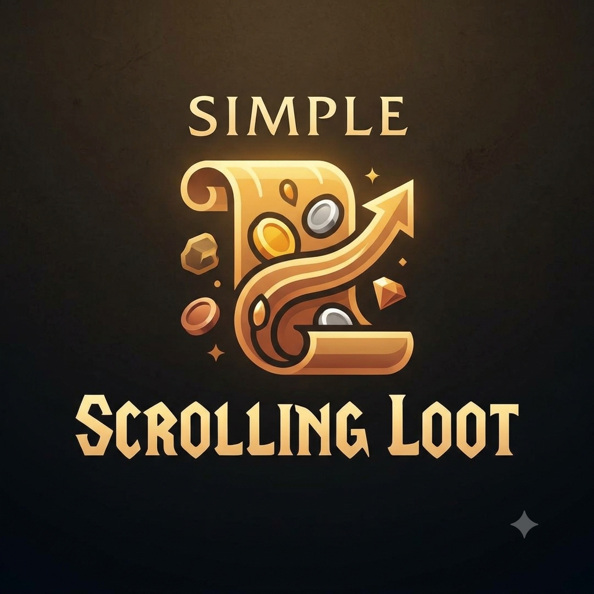

# Simple Scrolling Loot

<p align="center">
  
</p>

**Simple Scrolling Loot** (`SimpleScrollingLoot`) is a lightweight,
zero-dependency loot notification addon for World of Warcraft. It
renders its own notification rows and never uses Blizzard Scrolling Combat
Text.

> Development status: Alpha. Please test on the intended WoW client and
> report reproducible issues through GitHub.

## Client coverage

The addon is designed to work across WoW client variants through capability
detection rather than a runtime version gate. Run `/ssloot debug api` on every
target client before relying on a build there; compatibility is only claimed
after that client has been tested.

## Features

- **Your Loot Only**: Displays only item loot received by your character; party
  and raid member loot is always ignored.
- **Item Loot Notifications**: Displays item icon, rarity-colored name, and stack quantity.
- **Money Notifications**: Formatted gold, silver, and copper gains with coin icons.
- **Honor Gain Notifications**: Formatted honor gain notifications.
- **Optional Vendor Value**: Shows total vendor sell price for looted items.
- **Standalone Rendering**: Completely independent frame rendering (does NOT rely on Blizzard Scrolling Combat Text or `CombatText_AddMessage`).
- **Movable & Configurable Anchor**: Unlock and position your loot notifications anywhere on screen.
- **Customizable Appearance & Animation**: Adjust font size, icon size, scroll direction (UP/DOWN), duration, travel distance, opacity, max visible rows, and optional static mode.
- **Background Styling**: Enable a Blizzard-styled rounded-corner frame and
  adjust its opacity.
- **Optional Loot Frame Hiding**: Configurable behavior for hiding the standard Blizzard loot window during auto-looting, with modifier key bypass (e.g. SHIFT) and safety checks for quest items, BoP, and group loot.
- **Diagnostic Compatibility Probe**: Included `/ssl debug api` command to verify client API compatibility.

## Slash Commands

You can use `/ssl`, `/ssloot`, or `/simplescrollingloot`:

- `/ssl`, `/ssloot`, or `/simplescrollingloot` - Open options window
- `/ssl on` - Enable addon
- `/ssl off` - Disable addon
- `/ssl test` - Display test/preview notifications
- `/ssl unlock` - Unlock and display notification anchor for dragging
- `/ssl lock` - Lock notification anchor
- `/ssl reset` - Reset configuration to default settings
- `/ssl debug` - Toggle debug logging
- `/ssl debug api` - Print client API compatibility report
- `/ssl help` - Show slash command help

## Installation

Extract the `SimpleScrollingLoot` directory into your World of Warcraft
installation folder:

```text
World of Warcraft/<client>/Interface/AddOns/
```

Restart WoW or reload UI with `/reload`.

## Configuration

Open settings with `/ssloot`. The panel includes controls for item-quality
filtering, icons, vendor value, background, scale, font/icon sizes, duration,
fade, travel distance, spacing, scrolling direction, static mode, visible-row
limit, and Blizzard loot-frame behaviour. Enable **Rounded Corners** for a
Blizzard-styled rounded frame, then adjust its opacity.

Use `/ssloot unlock` to place the anchor, `/ssloot test` to preview the result,
and `/ssloot lock` when finished. The Blizzard loot-frame option always fails
open for loot that may require normal Blizzard interaction.

## Support

Report a reproducible issue at
https://github.com/Sukecz/SimpleScrollingLoot/issues. Include your WoW version,
locale, exact loot scenario, and `/ssloot debug api` output. Do not include
account, API, or authentication secrets in a report.

## Releases

Every push to `main` creates an Alpha build and uploads it to CurseForge project
`1624616`. Version tags in the form `v*` additionally create a matching GitHub
release. Tags containing `alpha` or `beta` publish that release type; other
version tags publish a Release.

Before creating the first release tag, add a repository Actions secret named
`CF_API_TOKEN` with a CurseForge author upload token. The token is never stored
in this repository. Only publish a Release after testing it in the intended WoW
client.

## License

MIT License
