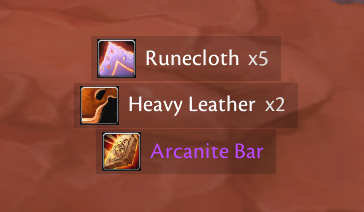

# Simple Scrolling Loot

<p align="center">
  
</p>

**Simple Scrolling Loot** (`SimpleScrollingLoot`) is a lightweight,
zero-dependency loot notification addon for World of Warcraft. It
renders its own notification rows and never uses Blizzard Scrolling Combat
Text.



> Current release: 0.6.0-beta.1.

## Client coverage

Version 0.6.0-beta.1 targets:

- WoW Classic Era, including Hardcore realms (`Interface 11509`);
- Burning Crusade Classic Anniversary Edition (`Interface 20506`);
- the WoW Forever beta (`Interface 16001`).

The package contains separate Vanilla, TBC, and Forever (`Camelot`) TOC metadata
while sharing one Lua implementation. Runtime checks use the loaded TOC flavor,
Blizzard project constants, and the beta interface fallback, then verify every
critical API before registering loot events. Retail, Mists of Pandaria Classic,
and other clients remain disabled.

Offline Lua and metadata tests cover all three target families. The settings and
positioning workflow introduced in 0.4.0 was confirmed in the current Classic
Era client. The Forever beta metadata and offline compatibility checks pass,
but the exact build report and live Forever loot matrix remain outstanding. See
[`COMPATIBILITY.md`](COMPATIBILITY.md).

## Features

- **Your Loot Only**: Displays only item loot received by your character; party
  and raid member loot is always ignored.
- **Item Loot Notifications**: Displays item icon, rarity-colored name, and stack quantity.
- **Money Notifications**: Formatted gold, silver, and copper gains with coin icons.
- **Optional Vendor Value**: Shows total vendor sell price for looted items.
- **Optional Bag & Bank Counts**: Shows separate non-zero quantities of the
  looted item held in bags and bank.
- **Standalone Rendering**: Completely independent frame rendering (does NOT rely on Blizzard Scrolling Combat Text or `CombatText_AddMessage`).
- **Simple Positioning**: Click **Move Notifications**, drag the visible box,
  and click **Finish Moving**.
- **Customizable Appearance & Animation**: Adjust font size, icon size, maximum width, scroll direction (UP/DOWN), duration, travel distance, opacity, max visible rows, and optional static mode.
- **Optional Item Interaction**: Enable normal item tooltips and standard modified item-link clicks without intercepting the mouse by default.
- **Background Styling**: Enable a Blizzard-styled rounded-corner frame and
  adjust its opacity.
- **Untouched Loot Window**: Never hooks, hides, or otherwise changes the Blizzard loot window.
- **Diagnostic Compatibility Probe**: Included `/ssl debug api` command to verify client API compatibility.

## Slash Commands

You can use `/ssl`, `/ssloot`, or `/simplescrollingloot`:

- `/ssl`, `/ssloot`, or `/simplescrollingloot` - Open options window
- `/ssl on` - Enable addon
- `/ssl off` - Disable addon
- `/ssl test` - Display test/preview notifications
- `/ssl unlock` - Show and move the notification position
- `/ssl lock` - Finish moving notifications
- `/ssl reset` - Reset configuration to default settings
- `/ssl debug` - Toggle debug logging
- `/ssl debug api` - Print client API compatibility report
- `/ssl help` - Show slash command help

## Installation

Extract the `SimpleScrollingLoot` directory into your World of Warcraft
installation folder:

```text
World of Warcraft/<client>/Interface/AddOns/
```

Restart WoW or reload UI with `/reload`.

## Windows deployment

Keep these two files together on Windows and double-click the `.cmd` launcher:

- `tools/windows/Deploy-WoW-Addons.cmd`
- `tools/windows/Deploy-WoW-Addons.ps1`

This is the shared deployment tool for Simple Scrolling Loot, Better Loot
Rolls, and Simple Arsenal Swap. It uses the existing `ssh minipc` connection,
tests all three projects on MINIPC, stages and validates all three downloads,
and then synchronizes their current runtime files into the Classic Era AddOns
folder. It does not touch WoW SavedVariables. The window closes automatically
after success and stays open on an error so the failure message can be read.

## Configuration

Open settings with `/ssloot`. The panel separates everyday choices from
advanced controls:

- **General** chooses what appears and which item qualities are shown.
- **Appearance** controls icons, text size, overall size, and background.
- **Movement & Position** controls placement, direction, timing, and spacing.
- **Advanced** contains optional mouse interaction, transparency, diagnostics,
  and reset.

Every control includes a visible explanation and takes effect immediately.
Use **Preview Notifications** at any time. To change the starting position,
click **Move Notifications**. The settings window closes so the blue box is
unobstructed. Use **Test Notifications** as often as needed, drag the blue box
into place, and click **Save** to lock it and return to settings.

## Support

Report a reproducible issue at
https://github.com/Sukecz/SimpleScrollingLoot/issues. Include your WoW version,
locale, exact loot scenario, and `/ssloot debug api` output. Do not include
account, API, or authentication secrets in a report.

## Releases

Every push and pull request runs Lua 5.1 syntax, regression, and TOC consistency
checks. Only version tags in the form `v*` package and upload a build to
CurseForge project `1624616` and create a matching GitHub release. Tags
containing `alpha` or `beta` publish that release type; other version tags
publish a Release.

Before creating a release tag, add a repository Actions secret named
`CF_API_TOKEN` with a CurseForge author upload token. The token is never stored
in this repository. Only publish a Release after testing it in the intended WoW
client.

## License

MIT License
